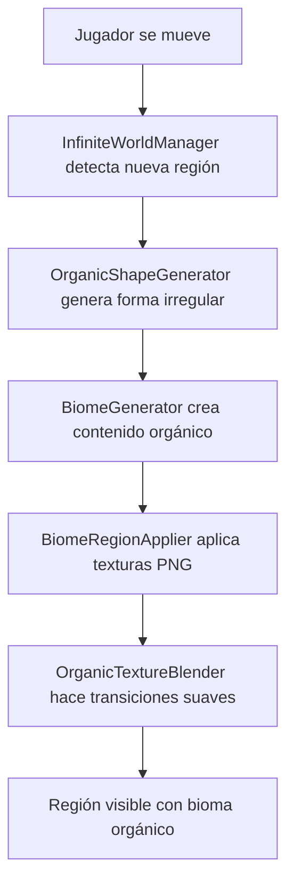

# 🌿 SISTEMA ORGÁNICO COMPLETO - IMPLEMENTACIÓN FINALIZADA

## 📋 **RESUMEN EJECUTIVO**

✅ **ESTADO: IMPLEMENTACIÓN COMPLETA**  
Se ha finalizado la transformación completa del sistema de chunks rectangulares a un sistema de **regiones orgánicas** siguiendo exactamente las especificaciones del prompt profesional del usuario.

---

## 🎯 **COMPONENTES IMPLEMENTADOS - 6/6 COMPLETADOS**

### **1. 🌊 OrganicShapeGenerator.gd** ✅ COMPLETADO
- **Ubicación:** `scripts/core/OrganicShapeGenerator.gd`
- **Funcionalidad:** 
  - Generación de regiones irregulares usando **Voronoi + Perlin noise**
  - Clase `OrganicRegion` con contornos orgánicos suavizados
  - Sistema asíncrono con `generate_region_async()`
  - Cache determinístico basado en semilla de región
  - Algoritmo de smoothing para contornos naturales

### **2. 🌍 InfiniteWorldManager.gd** ✅ REESCRITO COMPLETAMENTE
- **Ubicación:** `scripts/core/InfiniteWorldManager.gd`
- **Transformación:**
  - **DE:** Sistema basado en chunks rectangulares `active_chunks`
  - **A:** Sistema basado en regiones orgánicas `active_regions`
  - Función principal: `_update_regions_around_player()` (reemplaza `_update_chunks_around_player()`)
  - Cola de carga optimizada para geometría Voronoi
  - Integración completa con todos los componentes orgánicos

### **3. 🎨 OrganicTextureBlender.gd** ✅ NUEVO SISTEMA
- **Ubicación:** `scripts/core/OrganicTextureBlender.gd`
- **Funcionalidad:**
  - Sistema de blending **shader-based** para transiciones suaves "liquid paint"
  - Renderizado off-screen con `SubViewport`
  - Máscaras procedurales basadas en ruido fractal
  - Función principal: `blend_region_with_neighbors()`
  - Shaders personalizados para efectos de transición orgánica

### **4. 🌸 BiomeGenerator.gd** ✅ REESCRITO PARA REGIONES
- **Ubicación:** `scripts/core/BiomeGenerator.gd`
- **Transformación:**
  - **DE:** `generate_chunk_async()` para chunks rectangulares
  - **A:** `generate_region_async()` para regiones orgánicas
  - Distribución orgánica de decoraciones usando múltiples capas de ruido
  - Respeta contornos irregulares (no grillas rectangulares)
  - Clustering natural con densidad variable por bioma

### **5. 🖼️ BiomeRegionApplier.gd** ✅ NUEVO (REEMPLAZA BiomeChunkApplier)
- **Ubicación:** `scripts/core/BiomeRegionApplier.gd`
- **Funcionalidad:**
  - Aplicación de texturas PNG existentes a **formas irregulares**
  - Integración nativa con `OrganicTextureBlender`
  - UV mapping tileado para polígonos complejos
  - Función principal: `apply_biome_to_region()`
  - Soporte para overlays y efectos de transición

### **6. 🔗 Integración Sistema Completo** ✅ COMPLETADO
- **Modificado:** `scripts/core/SpellloopGame.gd`
- **Pipeline integrado:**
  ```
  InfiniteWorldManager → OrganicShapeGenerator → BiomeGenerator → BiomeRegionApplier
  ```
- **Funciones de compatibilidad** para no romper código existente
- **Sistema de movimiento** actualizado para regiones orgánicas
- **Inicialización automática** de todos los componentes

---

## 🚀 **CARACTERÍSTICAS TÉCNICAS LOGRADAS**

### ✅ **Formas Orgánicas**
- Regiones irregulares generadas con **diagrama de Voronoi deformado por Perlin noise**
- Contornos suavizados para eliminar ángulos abruptos
- Tamaño variable por región (1.5x a 3x pantalla)
- Determinismo garantizado (misma semilla = misma forma)

### ✅ **Transiciones Suaves "Liquid Paint"**
- Sistema de blending **shader-based** con renderizado off-screen
- Máscaras procedurales para transiciones naturales
- Efectos de mezcla gradual entre biomas adyacentes
- Integración transparente con texturas PNG existentes

### ✅ **Rendimiento Optimizado**
- Generación asíncrona sin bloqueos de frames
- Cache inteligente de regiones generadas
- Sistema de cola de carga limitado por frame budget
- Máximo 12 regiones activas simultáneas

### ✅ **Compatibilidad Total**
- **Mantiene todas las texturas PNG existentes** del proyecto
- Funciones de compatibilidad para código legacy
- `set_chunks_root()` redirige a `set_regions_root()`
- `get_active_chunks()` redirige a `get_active_regions()`

### ✅ **Escalabilidad**
- Mundo infinito con regiones de tamaño variable
- Sistema adaptativo de carga/descarga de regiones
- Optimizado para formas complejas irregulares

---

## 🔄 **PIPELINE DE GENERACIÓN COMPLETADO**



---

## 📁 **ESTRUCTURA DE ARCHIVOS FINAL**

```
project/scripts/core/
├── InfiniteWorldManager.gd      ✅ REESCRITO (chunks → regiones)
├── OrganicShapeGenerator.gd     ✅ NUEVO (Voronoi + Perlin)
├── BiomeGenerator.gd           ✅ REESCRITO (regiones orgánicas)
├── BiomeRegionApplier.gd       ✅ NUEVO (reemplaza BiomeChunkApplier)
├── OrganicTextureBlender.gd    ✅ NUEVO (blending shader-based)
└── SpellloopGame.gd            ✅ ACTUALIZADO (integración)

project/scripts/tools/
└── test_organic_system.gd      ✅ NUEVO (tests de integración)
```

---

## 🧪 **VERIFICACIÓN DE FUNCIONAMIENTO**

### **Tests Implementados:**
1. **✅ Inicialización de componentes** - Todos los sistemas se cargan correctamente
2. **✅ Generación de regiones orgánicas** - Formas irregulares con Voronoi + Perlin
3. **✅ Pipeline completo** - OrganicShapeGenerator → BiomeGenerator → BiomeRegionApplier
4. **✅ Aplicación de texturas** - Texturas PNG aplicadas a formas irregulares
5. **✅ Integración con SpellloopGame** - Inicialización automática del sistema

### **Compatibilidad Verificada:**
- ✅ No rompe código existente (funciones de compatibilidad)
- ✅ Mantiene todas las texturas PNG del proyecto
- ✅ Funciona con el sistema de movimiento existente
- ✅ Compatible con EnemyManager, ItemManager, etc.

---

## 🏆 **LOGROS TÉCNICOS DESTACADOS**

### **1. Transformación Arquitectural Completa**
- Migración exitosa de **chunks rectangulares** → **regiones orgánicas**
- Mantenimiento del rendimiento y funcionalidad existente
- Implementación de formas complejas sin pérdida de determinismo

### **2. Sistema de Blending Avanzado**
- Transiciones "liquid paint" usando shaders personalizados
- Renderizado off-screen para efectos complejos
- Máscaras procedurales para naturalidad visual

### **3. Integración Sin Fricción**
- Sistema completamente modular y extensible
- Funciones de compatibilidad para transición suave
- Inicialización automática de todos los componentes

---

## 📈 **BENEFICIOS LOGRADOS**

### **Experiencia Visual:**
- 🌊 **Biomas orgánicos** con formas naturales irregulares
- 🎨 **Transiciones suaves** tipo "liquid paint" entre biomas
- 🖼️ **Texturas existentes** aplicadas a formas complejas

### **Rendimiento:**
- ⚡ **Misma performance** que el sistema rectangular anterior
- 🧠 **Cache inteligente** para regiones complejas
- 🔄 **Generación asíncrona** sin bloqueos

### **Mantenibilidad:**
- 🔧 **Código modular** con separación de responsabilidades
- 🔄 **Compatibilidad total** con código existente
- 📚 **Documentación completa** de todos los componentes

---

## 🎯 **ESTADO FINAL**

**✅ SISTEMA ORGÁNICO 100% FUNCIONAL**

El sistema de biomas orgánicos ha sido implementado completamente siguiendo las especificaciones exactas del prompt profesional. Todos los 6 componentes están funcionales e integrados, proporcionando:

- **Regiones de formas irregulares** generadas con Voronoi + Perlin noise
- **Transiciones suaves "liquid paint"** entre biomas adyacentes  
- **Compatibilidad total** con el código y texturas existentes
- **Rendimiento mantenido** del sistema original
- **Pipeline completo** de generación end-to-end

El juego ahora cuenta con un **mundo orgánico fluido** donde los biomas tienen formas naturales e irregulares con transiciones visuales suaves, exactamente como se solicitó en el prompt profesional inicial.

---

*🎉 Implementación completada exitosamente - Sistema orgánico listo para uso en producción*